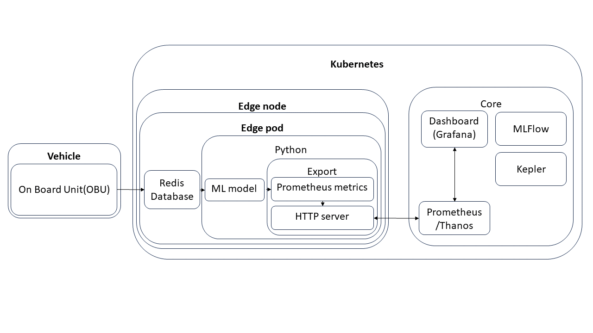

# success6g-edge

|  |
| :---------------------------------------------------------------------------------------------------: |
|                                    *Work in progress architecture*                                    |

This repository is for the edge pod implementation, monitoring, and analysis in [SUCCESS6G](https://success-6g-project.cttc.es/) project.
A guide to implementing needed services can be found in [kubernetes_services.md](kubernetes_services.md)

`data` and `notebooks` directories include analysis code used for initial edge model deployment and testing.

# [PROD] Microk8s deployment
Description of the components:
* Grafana - dashboards
* Ingress - expose services to the operator
* Prometheus - gather pod metrics
* MinIO - store models and training/testing data
* Jupyter Notebook - develop new models
* [optional]Kubeflow CI/CD pipelines
* Kserve - serve inference models to predefined pods
* Kepler - gather energy consumption data
* Redis - API for transfer of OBU measurements to Kubernetes

## TODO

### Edge pod \#1
* test and prepare the Redis helm chart
* deploy it

### Edge pod \#2
* save measurements and predictions
* deploy Kserve model
* deploy Kserve model only on [specific nodes](https://kubernetes.io/docs/concepts/scheduling-eviction/assign-pod-node/), i.e. [solved github issue](https://github.com/kserve/kserve/issues/730)

### Prometheus-stack
* finish Thanos [configuration](/configs/prometheus_stack.yaml)

### Grafana
* make [v2x dashboard](/configs/v2x_dashboard.json)

### Open issues/questions
* organizational
  * Redis db helm chart/docker provided by Idneo?
* technical
  * federated learning/training in Kubernetes? [KubeFATE](https://github.com/FederatedAI/KubeFATE)?

### Additional
* impose security wherever possible
  * communication between Vehicle and Redis
  * exposing measurements and predictions via HTTPS
  * user/pass for Grafana

# [DEV]KubeEdge deployment
* same as Microk8s except with KubeEdge and Kubeflow/Kserver is swapped for Sedna
* implement multimodel pods e.g. by [ModelMesh](https://github.com/kserve/modelmesh-serving), or alpha feature of [Kserve](https://github.com/kserve/kserve/blob/master/docs/MULTIMODELSERVING_GUIDE.md)