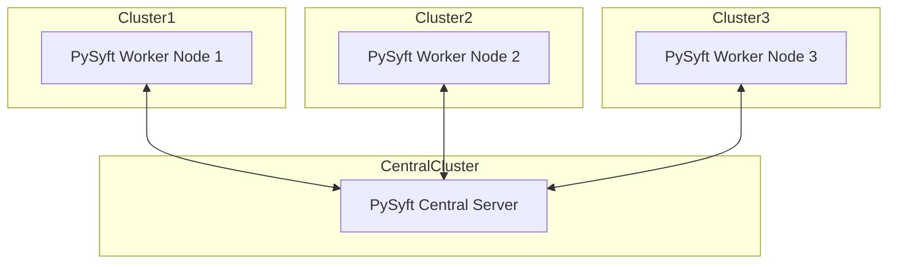

# success6g-edge

|                          |
| :--------------------------------------------------------------------------------------------------------------: |
| *Basic Architecture Overview, more detailed information in [architecture_overview.MD](architecture_overview.MD)* |

This repository is for the edge pod implementation, monitoring, and analysis in [SUCCESS6G](https://success-6g-project.cttc.es/) project.

Table of contents
* [detailed description of the use cases](use_cases.MD)
* [explanation of the communication between the services](networking.MD)
* [description of Research&Development setup](development.MD)
* [description of Testing setup](testing.MD)
* [a guide to implementing needed services](kubernetes_services.MD)
* [computational requiremetns of the services](kubernetes_services_requirements.MD)
* [vehicle injector tool](tools/vehicle/readme.md) - tool to inject example v2x data into Redis database
* [example v2x sensor data](data/log_tiguan_27_mar_dac.txt) provided by [Idneo](https://www.idneo.com/)
* [example v2x aggregated sensor data](tools/vehicle/datasets/ateca_R4_2.0l_TDI/README.md) provided by [Idneo](https://www.idneo.com/)
* `data` and `notebooks` directories include analysis code used for initial edge model deployment and testing.

## Solution overview
Solution is deployed in Microk8s.

Description of the components:
* [Grafana](https://grafana.com/) - dashboards
* [Ingress](https://kubernetes.io/docs/concepts/services-networking/ingress/) - expose services to the operator
* [Prometheus](https://prometheus.io/docs/introduction/overview/) - gather pod metrics
* [InfluxDB](https://www.influxdata.com/) - gather vehicular measurements and predictions
* [MinIO](https://min.io/) - store models and training/testing data
* [JupyterHub](https://z2jh.jupyter.org/en/stable/) - develop new models
* [MLflow](https://mlflow.org/) - MLops, experiment and model tracking
* [Kserve](https://kserve.github.io/website/latest/) - serve inference models to predefined pods
* [Istio](https://istio.io/) - to ensure optimal traffic flow between microservices
* [Knative](https://knative.dev) - to ensure autoscaling of inference service pods
* [Kepler](https://sustainable-computing.io/) - gather energy consumption data
* [Redis](https://redis.io/) - API for transfer of OBU measurements to Kubernetes

## TODO

* federated learning/training in Kubernetes:
  * **[PySyft [PREFERRED]](https://github.com/OpenMined/PySyft/tree/dev)**
    * focuses on strong privacy-preserving techniques, offering advanced security features for sensitive data
    * easy to [deploy workers/clients](https://github.com/OpenMined/PySyft/blob/dev/notebooks/tutorials/deployments/00-deployment-types.ipynb)
  * [Flower](https://github.com/adap/flower)
    * emphasizes flexibility and ease of integration with existing machine learning frameworks, suitable for rapid prototyping and deployment
    * more focused on [iOS and Android deployment](https://flower.ai/docs/)
  * [KubeFATE](https://github.com/FederatedAI/KubeFATE) - focused towards secure, scalable enterprise applications with advanced privacy-preserving techniques

## Additional ideas 
* KubeEdge deployment - same as Microk8s except with KubeEdge and Kubeflow/Kserver is swapped for Sedna
* implement multimodel pods e.g. by [ModelMesh](https://github.com/kserve/modelmesh-serving), or alpha feature of [Kserve](https://github.com/kserve/kserve/blob/master/docs/MULTIMODELSERVING_GUIDE.md)
* use [Rancher](https://www.rancher.com/) to manage multi cluster Kubernetes