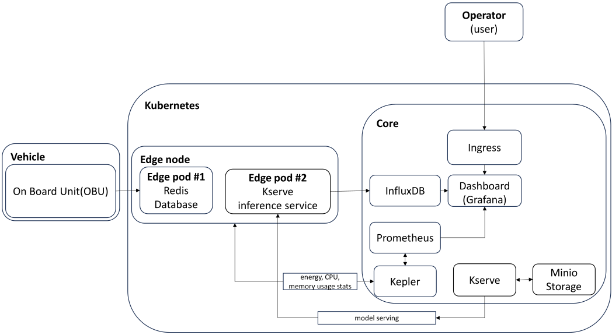

# Architecture

## Basic Architecture

|  |
| :----------------------------------------------------------------------------------------------------: |
|                                          *Basic Architecture*                                          |

## Single cluster architecture

|  |
| :-------------------------------------------------------------------------------------------------------------------------------: |
|                                                   *Single cluster architecture*                                                   |

Advantages:
* Simplified Management:
    * Easier to manage and maintain as there's only one cluster.
    * Simplified network configuration and service discovery within the cluster.
* Resource Efficiency:
    * Better utilization of resources since there is no need to allocate separate resources for multiple clusters.
* Cost-Effective:
    * Lower operational costs due to reduced overhead in managing multiple clusters.
    * Reduced complexity in monitoring and logging, leading to potential cost savings.
* Unified Security and Policy Management:
    * Simplified implementation of security policies, access controls, and compliance measures.
* Consistent Environment:
    * Ensures a consistent environment across all nodes, simplifying development and deployment processes.

Disadvantages:
* Scalability Limitations:
    * May face scalability issues as the number of edge devices or workloads increases.
    * Single point of failure; if the cluster goes down, all connected devices and services are affected.
* Performance Bottlenecks:
    * Potential for performance bottlenecks if the cluster becomes overloaded.
    * Limited fault isolation; issues in one part of the cluster can impact the entire system.
* Geographical Constraints:
    * Less optimal for geographically distributed edge nodes as latency might increase.
    * May not efficiently handle diverse network conditions across different locations.

## Single cluster architecture (advanced)

| ") |
| :-----------------------------------------------------------------------------------------------------------------------------------------------------------: |
|                                                            *Single cluster architecture(advanced)*                                                            |

Architecture improved by involving service mesh for optimal micro service traffic routing. For more info see [istio documentation](https://istio.io/latest/docs/ops/deployment/architecture/)

## Multi cluster architecture

|  |
| :----------------------------------------------------------------------------------------------------------------------------: |
|                                                  *Multi cluster architecture*                                                  |

Multi cluster deployment that can utilize dUPF metrics (e.g. number of connected users) to decide if the application should be deployed in a neighboring micro cluster

Advantages:
* Scalability and Fault Isolation:
    * Better scalability by distributing workloads across multiple clusters.
    * Improved fault isolation; problems in one cluster do not affect others.
* Geographical Distribution:
    * Optimized for geographically distributed deployments, reducing latency by placing clusters closer to the edge devices.
    * Can handle diverse network conditions more effectively.
* Performance Optimization:
    * Easier to optimize performance by dedicating clusters to specific workloads or regions.
    * Enhanced load balancing and resource distribution.
* Resilience and High Availability:
    * Higher resilience and availability; failure in one cluster can be mitigated by other clusters.
    * Enhanced disaster recovery capabilities.

Disadvantages:
* Increased Complexity:
    * More complex to manage and maintain multiple clusters.
    * Higher administrative overhead in coordinating and synchronizing clusters.
* Resource Overhead:
    * Requires more resources for cluster management (e.g., control planes for each cluster).
    * Potentially higher infrastructure costs due to multiple clusters.
* Security and Policy Management:
    * More complex to implement and manage security policies and compliance across multiple clusters.
    * Potential challenges in maintaining consistent security postures across clusters.
* Inter-Cluster Communication:
    * Requires robust inter-cluster communication mechanisms, which can add to the complexity.
    * More complicated service discovery and networking between clusters.

### Conclusion

The choice between single-cluster and multi-cluster Kubernetes deployments for IoT on the edge depends on factors such as scale, geographic distribution, resource availability, and management complexity. Single-cluster deployments are simpler and more cost-effective for smaller, localized environments, whereas multi-cluster deployments offer better scalability, fault isolation, and performance optimization for larger, distributed environments.