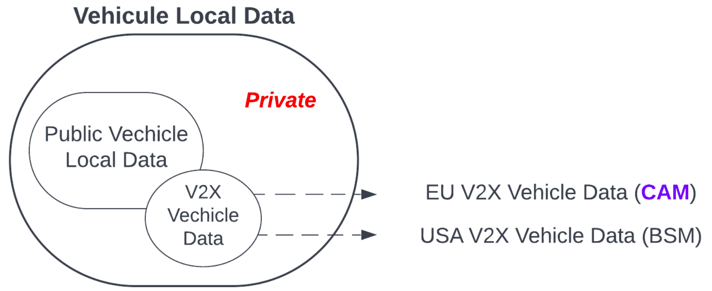
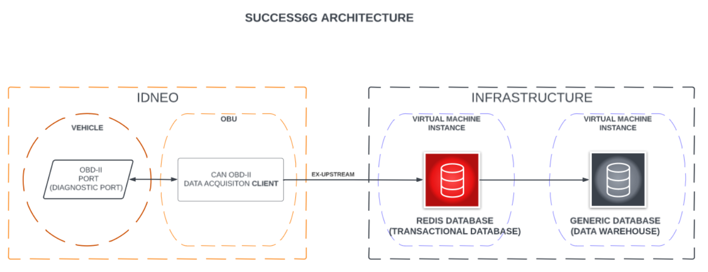

# Data management

The choice of data storage and management options was influenced by the following factors:
* time series data (measurements and predictions) -> time series database
  * easy to administer, popular solution with helm chart available by developers and Python API support -> [InfluxDB](https://www.influxdata.com/) 
* responsibility ownership of communication between vehicle and endpoint (v2x communication) on v2x measurement provider, i.e. [Idneo](https://www.idneo.com/) -> Idneo choice - [Redis](https://redis.io/)
* monitoring of energy consumption(carbonn footprint) + CPU/GPU/RAM utilization in Kubernetes -> [Prometheus](https://prometheus.io/docs/introduction/overview/) + [Kepler](https://sustainable-computing.io/) + [Grafana](https://grafana.com/)

## Local/edge data management

Both the vehicle On Board Unit (OBU) and endpoint API are administered by Idneo [Idneo](https://www.idneo.com/).

*V2X vehicle measurements* refer to the data that the vehicle uses to communicate its presence on the road. This data is essential in Intelligent Transportation Systems (ITS) to complement and provide the Cooperative Awareness (CA) service, which generates Cooperative Awareness Messages (CAM) according to the European standard ETSI, equivalent to the Basic Safety Message (BSM) of the American standard (SAE).
The data shared through V2X in ITS services represents only a small portion of the data available in the vehicle's internal network

|   |
| :--------------------------------------------------------------------------------------------------------------: |
| *Notice that generating simple V2X messages with their mandatory data, only requires the public vehicle data. However, a V2X stack has an interface where car manufacturers can insert some private data to enrich the V2X messages (these are optional fields)* |

The data is sampled through the OBDII diagnostic port by constant polling. This data is uploaded to a transactional database
Each variable has its operating range and units. For more details, see [On-board diagnostics parameter definitions](https://en.wikipedia.org/wiki/OBD-II_PIDs#Service_01).

|   |
| :--------------------------------------------------------------------------------------------------------------: |
| *For a detailed communication description, i.e. how the communication is enforced to stay in an edge node, please see [explanation of the communication between the services](networking.md)* |

* single cluster Kubernetes
  * the Redis database is deployed on every edge node by use of Kubernetes [pod assigning options](https://kubernetes.io/docs/concepts/scheduling-eviction/assign-pod-node/) and defining [DaemonSets](https://kubernetes.io/docs/concepts/workloads/controllers/daemonset/) that will run a pod on every selected node
* multi-cluster Kubernetes
  * multi-cluster environment suggests the use of a small cluster per edge location, in this case, a separate Redis database deployment in each cluster is sufficient 

## Predictions

If there is no responsibility ownership division an Inference Service provided by [Kserve](https://kserve.github.io/website/latest/) would be an endpoint for OBU. Compatibility with this scenario is assured by model [`predict` methods](https://github.com/5uperpalo/success6g-edge/blob/3c95dbc169cff5237767d47aa81f8e8491fb9ea3/inference_model/training/_base.py#L129).
As the Redis database is an endpoint for OBU we use the Redis client channel subscription method to get the latest vehicle measurements and forward the predictions to the central Influx database.

## Additional notes to "Local/edge data management" and "Predictions"

* channel subscription scenario is not "usual" as inference service is used indirectly
* keeping the v2x data on the edge reduces communication overhead and if necessary for analysis it can be (i) queried from the Redis database or (ii) aggregated to InfluxDB by use of [Telegram](https://docs.influxdata.com/flux/v0/stdlib/contrib/sranka/telegram/)
* keeping the v2x data on the edge also reduces the possible security/privacy concerns caused by transferring all the data to the central location
* we do not use Prometheus for predictions storing as Prometheus is designed for scraping metrics and not storing data; storing functionality can improved by [Thanos](https://thanos.io/), but the solution is primarily designed for metrics not measurements and predictions
* we do not use Grafana for visualization of predictions as InfluxDB by default includes User Interface(UI) for visualization and forwarding data to Grafana would cause additional unnecessary data communication

## System Metrics

We use combination of [Prometheus](https://prometheus.io/docs/introduction/overview/) + [Kepler](https://sustainable-computing.io/) + [Grafana](https://grafana.com/) to monitor resource utilization inside the cluster. This data can be later used for downscaling the solution and reducing the carbon footprint in production.