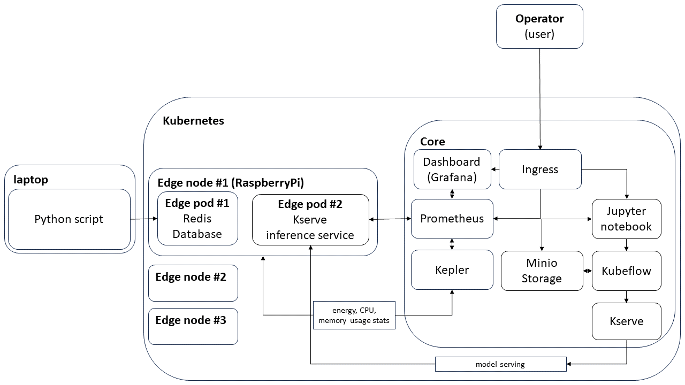

# R&D – Testbed (SUPERCOM)

|  |
| :-------------------------------------------------------------------------------------------------------: |
|                                            *R&D Architecture*                                             |

steps:

* setup full testbed
* use RaspberryPis to emulate edge nodes
* send gathered data using Python script and target specific edge nodes (emulation of vehicle moving between base stations)
* test centralized vs edge computation vs federated learning
* query and save Kepler stats (CPU,RAM usage + CO2 estimation) from Prometheus
* query and save measurements and predictions from Prometheus
* make screenshots: Grafana, Testbed environment
* make pictures of used HW (RaspberyPis, workstation, SUPERCOM servers rack?)

