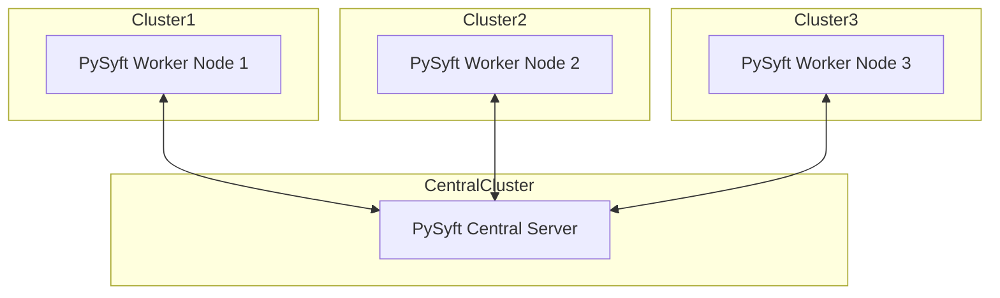

# Machine learning model development

## Centralized training

The project is focused on developing a production-ready solution. At the time of writing the documentation, we do not have vehicular measurements that would include labels with vehicle faults. We focus on exploring the best possible overall/engineering solutions as opposed to finding the best-performing model. Centralized training is therefore first choice for implementation.

* advantages:
    * simplified data management - having all data in one place can simplify data management, preprocessing, and cleaning
* disadvantages:
    * privacy concerns - ggregating data from multiple sources can lead to significant privacy issues, especially with sensitive information
    
### Online/stream vs batch

[V2X](https://en.wikipedia.org/wiki/Vehicle-to-everything) measurements form a stream of data from a vehicle to AI/ML on the edge. Unfortunately, this causes issues with the possibility of a high number(100-10,000?) streams per edge location. Until such a system is implemented we do not know the probable number of streams per edge location and we are unable to define requirements of the system that would be able to process X streams with Y data points per second. Such a system has to be able to process streams either by multi-threading or parallel processing. Also, methods like [ADWIN](https://riverml.xyz/dev/api/drift/ADWIN/) as the window size is reset to the initial value each time vehicle changes edge device as the state of the ML model can't be migrated between locations per vehicle as of the number of vehicles and their traveling speed VS migration time of the model to a new location. For now, we pick the "easier" option of batch processing where (i) every sample is treated individually, or (ii) samples from the same vehicle are processed in fixed batch sizes

### Deep vs "Traditional"

As we are dealing with strictly tabular data we focus on the tree-based model solution implementation. For detailed answer, we refer a reader to e.g. paper ["Why do tree-based models still outperform deep learning on tabular data?"](https://arxiv.org/abs/2207.08815)

## [TODO] Federated learning/training

We implement a federated learning model to address concerns of privacy and data management in case of multi-cluster solution.

* advantages:
    * enhanced privacy - raw data never leaves the local devices, reducing privacy risks
    * reduced data transfer - only model updates (rather than raw data) are transmitted, which can be more bandwidth-efficient
    * compliance - easier to comply with data sovereignty and privacy regulations since data remains local
    * fault tolerance - the system can be more resilient to individual server failures since the data and computation are distributed
* disadvantages:
    * complexity - implementing federated learning is more complex due to the need to manage distributed training, aggregation, and synchronization
    * heterogeneity - variability in data quality and distribution across devices can impact model performance
    * limited computational resources - Local devices may have limited computational power compared to centralized data centers
    * communication overhead - while raw data isn't transferred, frequent model updates can still generate significant communication overhead, especially in large-scale systems

* **[PySyft [PREFERRED]](https://github.com/OpenMined/PySyft/tree/dev)**
    * focuses on strong privacy-preserving techniques, offering advanced security features for sensitive data
    * easy to [deploy workers/clients](https://github.com/OpenMined/PySyft/blob/dev/notebooks/tutorials/deployments/00-deployment-types.ipynb)
* [Flower](https://github.com/adap/flower)
    * emphasizes flexibility and ease of integration with existing machine learning frameworks, suitable for rapid prototyping and deployment
    * more focused on [iOS and Android deployment](https://flower.ai/docs/)
* [KubeFATE](https://github.com/FederatedAI/KubeFATE) - focused towards secure, scalable enterprise applications with advanced privacy-preserving techniques