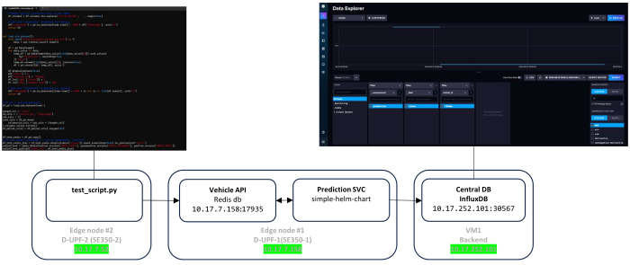

# Real-world testing and data gathering - Parcmotor Castellolí administered by [Cellnex](https://www.cellnex.com/news/noticia-105/)


|  |
| :----------------------------------------------------------------------------------------------------------------------------: |
|                                               *Castellolí testing architecture*                                                |

|  |
| :-------------------------------------------------------------------------------------------------------------------------------------: |
|                                                    *Castellolí testing architecture*                                                    |

legend: 

* white - mandatory
* <span style="color:grey">grey pattern - optional</span>

<details markdown>
<summary>steps:</summary>

* prepare the Kserve model and helm charts
* make testing requests before the day of testing
* run the real-world test with vehicles in Castelloli
* query and save Kepler stats (CPU,RAM usage + CO2 estimation) from Prometheus
* query and save measurements and predictions from Prometheus
* make screenshots: Grafana, NBC environment
* make vehicle pictures
</details>

## Testing of prediction service without vehicle

|  |
| :---------------------------------------------------------------------------------------------: |
|                              *Castellolí testing without vehicle*                               |

Testing of the [simple-helm-chart](https://github.com/5uperpalo/success6g-edge/tree/main/inference_model_helm_charts) deployed on dUPF1 by running a [test_script.py](https://github.com/5uperpalo/success6g-edge/tree/main/) from dUPF2.

To access Influx db in browser(admin/admin_pass): http://localhost:3000/
```
ssh -L 3000:localhost:3000 fog_user@10.17.252.101
kubectl port-forward svc/influx-influxdb2 -n influx 3000:80
``` 