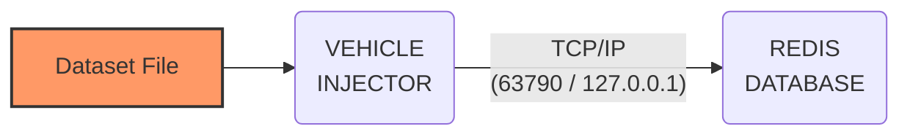

# Vehicle Injector Tool
This tool facilitates the incorporation of real data from a vehicle's sensors, stored in csv Datasets.
Its purpose is to facilitate the development of algorithms responsible for processing the information
that is collected and stored in this REDIS database within the Success6G project.

## Usage
Install the Redis database in your local development setup.

> docker_compose -d configs/edge_redis.yaml

Verify docker container is running 

> docker ps -a

Run “Vehicle Injector“ script with dataset and station-id script:

> python3 vehicle_injector.py -f <dataset_file.csv>
