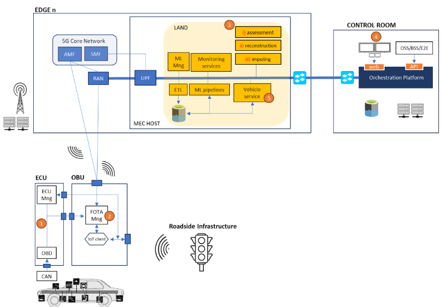
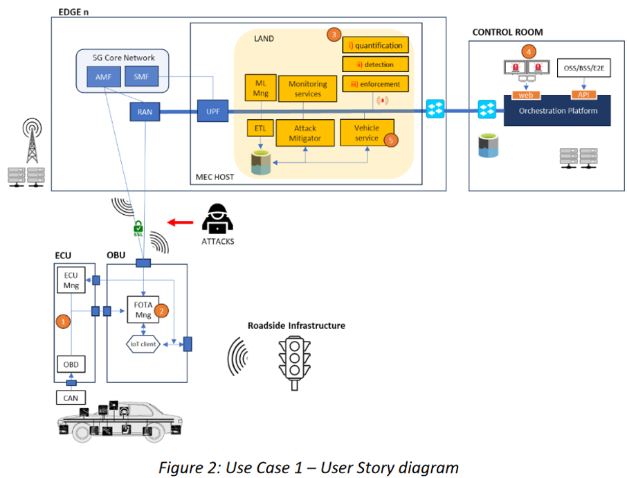
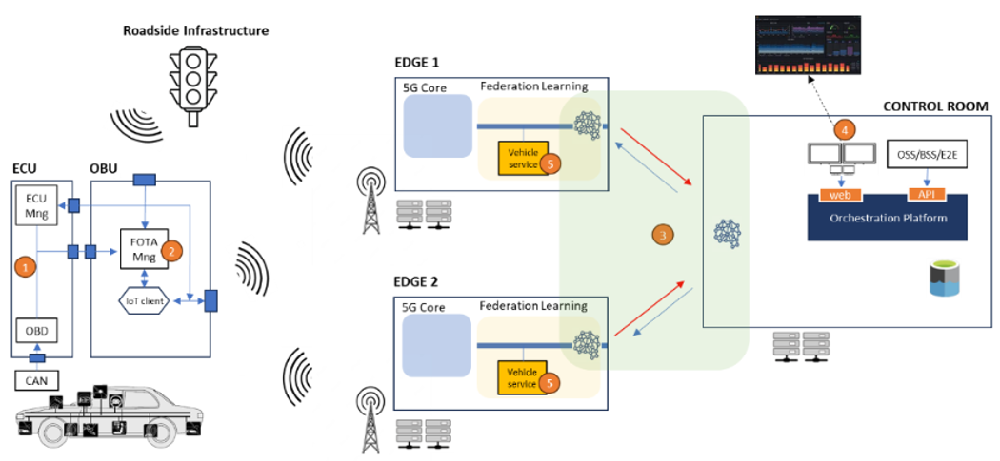
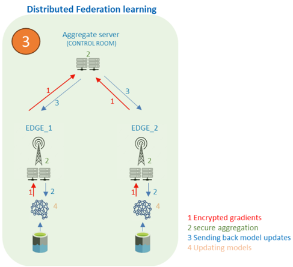

# Vehicular condition monitoring with robust V2X connectivity - EXTEND

|  |
| :---------------------------------------------------------------------: |
|                            *Use Case Extend*                            |

**Description:** A C-V2X infrastructure provides coverage to the connected vehicle throughout its trajectory for monitoring purposes. However, wireless transmission of in-vehicle monitoring data comes inadvertently with challenges which involve distortions and missing data owing to the inherently shared wireless medium. Incomplete vehicular data attributed to either increased interference levels, channel attenuation phenomena or sensor malfunctioning may lead to incorrect decision-making and failure to predict maintenance actions. Addressing the degradation of transmitted V2X data is thus essential for high-fidelity estimation of the system network state and informed actions. In this context, machine learning (ML)-empowered signal reconstruction and imputation techniques are expected to obtain accurate estimates of incomplete sensor trajectories by leveraging the intrinsic spatiotemporal synergies of captured information. By deeply investigating the interplay between vehicle dynamics and fault provisioning, faulty vehicular equipment will be timely detected/predicted, improving road safety by preventing critical failures.

# Vehicular condition monitoring with robust V2X connectivity - DEVISE

|  |
| :---------------------------------------------------------------------: |
|                            *Use Case Devise*                            |

**Description:** A C-V2X infrastructure provides coverage to the connected vehicle throughout its trajectory for monitoring purposes. Wireless transmission of in-vehicle monitoring data is susceptible to various security threats which may destabilize system operation, degrade network performance, and potentially lead to incorrect decision-making regarding the vehicle condition status. At the same time, the pervasive integration of data-driven techniques expands the attack surface, giving rise to finely targeted, stealthier, and scalable attacks targeting both phases (training, inference) of ML techniques. The mitigation of such threats becomes imperative for the correct estimation of vehicle condition. Condition monitoring data used for subsequent predictive diagnostics should be properly secured such that they do not contain falsified information, while abnormal traffic should be detected and isolated in its entirety. In this context, appropriate security countermeasures are expected to accurately detect malicious content in the transmitted information and ensure the semantic correctness of the aggregated data for trustworthy decision-making.

# Vehicular condition monitoring with robust V2X connectivity - VERIFY

|  |  |
| :---------------------------------------------------------------------------: | :---------------------------------------------------------------------------: |
|                             *Use Case Extend 01*                              |                             *Use Case Extend 02*                              |

**Description:** A C-V2X infrastructure provides coverage to the connected vehicle throughout its trajectory for monitoring purposes. The limited computational capabilities of edge nodes pose significant challenges for the realization of computationally efficient V2X communication aimed for condition monitoring. Aiming to achieve dramatically reduced data processing times, over-the-air computing methods and decentralized deployments of AI models aim at rapid knowledge extraction from the vehicular measurement streams and reduction of computational overhead. In this context, over-the-air computing methods will be explored to address the computational limitations and stringent latency requirements in V2X systems by means of over-the-air aggregation. In addition, decentralized methods for predictive diagnosis of vehicles condition will be investigated to leverage the benefits of edge-computing capabilities for efficient inference, aiming at minimizing the vehicle downtime incidents. The integration of both approaches holds the promise of distributed learning parallelization over the wireless compute medium and the realization of data intensive V2X services with stringent performance requirements.