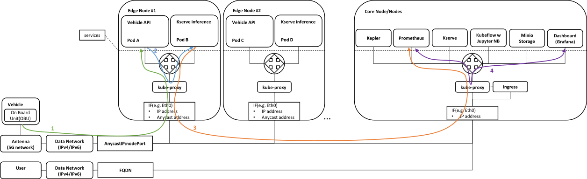
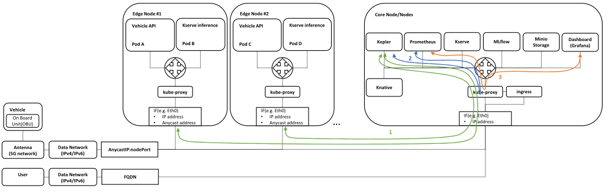
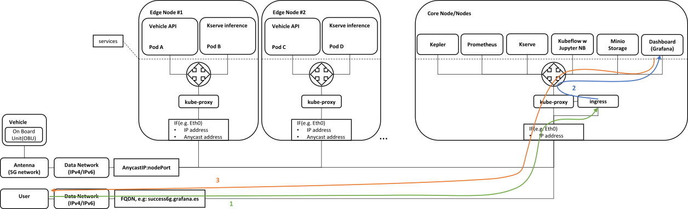
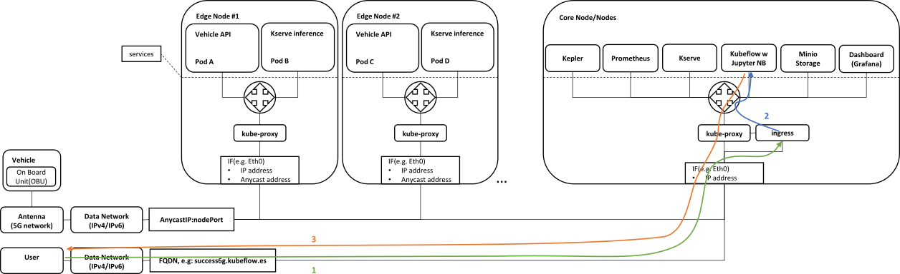
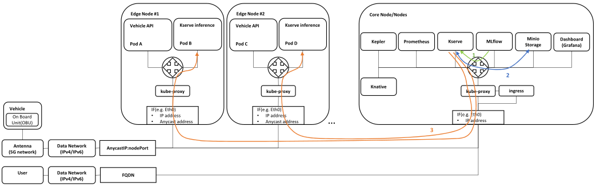

# Networking

Description of traffic flow for simple(no Istio) Single cluster traffic flow.

## Vehicle data processing

|  |
| :-----------------------------------------------------------------------------------------------------------------------------------------------------: |
|                                                                *Vehicle data processing*                                                                |

Traffic flow:

1. Vehicle sends measurements to Vehicle API service (provided by Idneo – data preprocessing +Redis DB)
  * transmission is received by antenna
  * Transmission enters data(IPv4/IPv6) network
  * Data is forwarded to the closest Kubernetes Edge node using (i) Anycast IP address, shared by all Edge Nodes, and (ii) nodePort defined in NodePort service
  * Edge Node receives the data, checks the IP table in kube-proxy, and forwards it to local Pod A as the service is configured with `externalTrafficPolicy: Local`
    * If there is no local Pod for Vehicle API service, the packet is dropped
2. Vehicle API service forwards the data to the ML prediction service(Kserve inference)
  * Data is forwarded to Pod B as Kserve inference service is configured with `internalTrafficPolicy: Local`
    * If there is no local Pod for Kserve inference service, the packet is dropped
  * or ML prediction service pod periodically queries local Redis DB in Vehicle API service – as Vehicle API service is also configured with `internalTrafficPolicy: Local`
    * If there is no local Pod for Vehicle API service, the queries/requests are dropped
3. Kserve inference service pushes the data into Prometheus
4. Grafana periodically queries data from Prometheus

## Energy consumption monitoring

|  |
| :-----------------------------------------------------------------------------------------------------------------------------------------------------------------------: |
|                                                                      *Energy consumption monitoring*                                                                      |

Traffic flow:

1. Kepler exporter uses eBPF to probe CPU, GPU, RAM performance counters and exposes them over time via HTTP
2. Prometheus periodically queries Kepler exporter for a new data
3. Grafana periodically queries Prometheus for anew data

## Vehicle data and energy consumption monitoring

|  |
| :--------------------------------------------------------------------------------------------------------------------------------------------------------------------------------------------------------------------------: |
|                                                                                       *Vehicle data and energy consumption monitoring*                                                                                       |

Traffic flow:

1. User enters Grafana FQDN in the web browser and is forwarded to the Ingress controller
2. Ingress controller translates the FQDN to the appropriate service and forwards it
3. Grafana GUI comes up in the Users web browser

## ML model development/update

|  |
| :-----------------------------------------------------------------------------------------------------------------------------------------------------------------: |
|                                                                    *ML model development/update*                                                                    |

Traffic flow:

1. User enters Kubeflow FQDN in the web browser and is forwarded to the Ingress controller
2. Ingress controller translates the FQDN to the appropriate service and forwards it
3. Kubeflow GUI comes up in the Users web browser and user can spawn a Jupyter Notebook  in the Kubeflow to develop a new ML inference model

## ML model deployment

|  |
| :------------------------------------------------------------------------------------------------------------------: |
|                                                *ML model deployment*                                                 |

Traffic flow:

1. Kubeflow instructs Kserve to deploy a model
2. Kserve queries the model from Minio storage
3. Kserve updates/”serves” the model in all Kserver inference Pods

