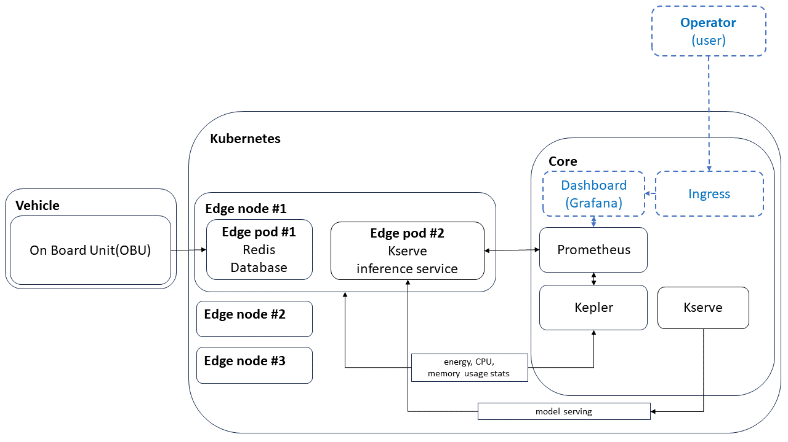

# WORK IN PROGRESS: Real-world testing and data gathering - Parcmotor Castellolí 

|  |
| :------------------------------------------------------------------------------------------------------------------------: |
|                                             *Real-world Testing Architecture*                                              |

legend: 
* mandatory
* Optional

steps:

* prepare the Kserve model and helm charts
* make testing requests before the day of testing
* run the real-world test with vehicles in Castelloli
* query and save Kepler stats (CPU,RAM usage + CO2 estimation) from Prometheus
* query and save measurements and predictions from Prometheus
* make screenshots: Grafana, NBC environment
* make vehicle pictures

