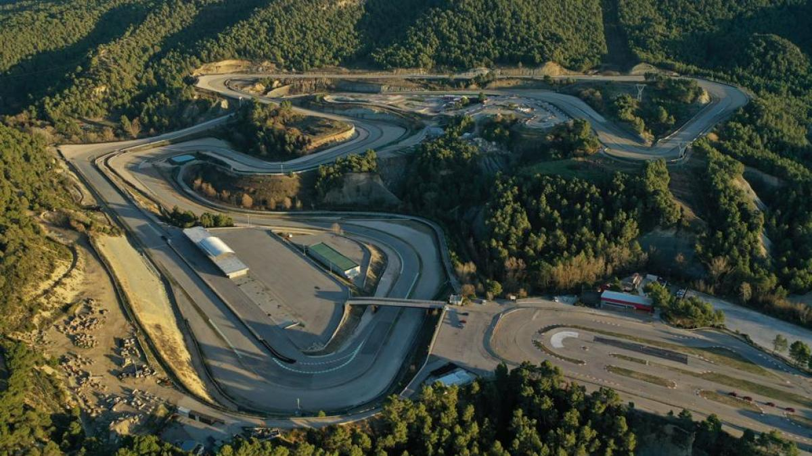

# Real-world testing and data gathering - Parcmotor Castellolí administered by [Cellnex](https://www.cellnex.com/news/noticia-105/)

|  |
| :-----------------------------------------------------------------------------------------------------------------------------------------: |
|                                                      *Castellolí testing architecture*                                                      |

|  |
| :--------------------------------------------------------------------------------------------------------------------------------------------------: |
|                                                          *Castellolí testing architecture*                                                           |

legend: 
* white - mandatory
* grey pattern - optional

steps:

* prepare the Kserve model and helm charts
* make testing requests before the day of testing
* run the real-world test with vehicles in Castelloli
* query and save Kepler stats (CPU,RAM usage + CO2 estimation) from Prometheus
* query and save measurements and predictions from Prometheus
* make screenshots: Grafana, NBC environment
* make vehicle pictures

